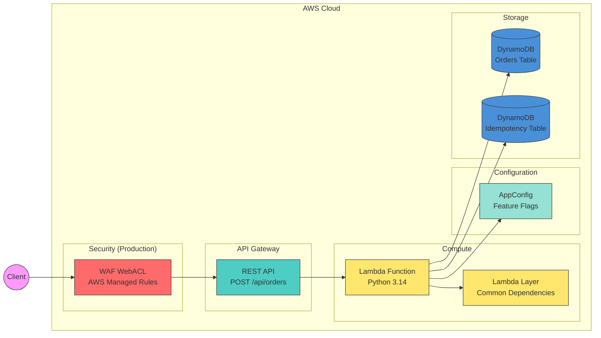
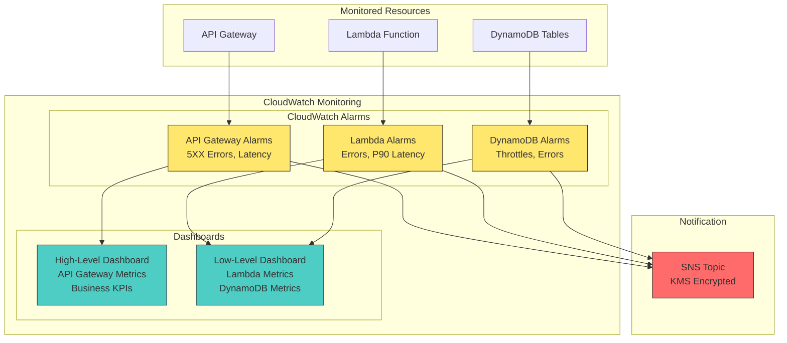

# AWS Lambda Handler Cookbook (Python)

[](https://github.com/ran-isenberg/aws-lambda-handler-cookbook/blob/master/LICENSE)

[](https://codecov.io/github/ran-isenberg/aws-lambda-handler-cookbook)


This project provides a working, open source based, AWS Lambda handler skeleton Python code includingx DEPLOYMENT code with CDK and a pipeline.

This project can serve as a blueprint for new Serverless services - CDK deployment code, pipeline and handler are covered.

**[📜Documentation](https://ran-isenberg.github.io/aws-lambda-handler-cookbook/)** | **[Blogs website](https://www.ranthebuilder.cloud)**
> **Contact details | mailto:ran.isenberg@ranthebuilder.cloud**

[](https://twitter.com/RanBuilder)
[](https://www.ranthebuilder.cloud/)

## AWS Recommendation

This repository was recommended in an AWS blog post [Best practices for accelerating development with serverless blueprints](https://aws.amazon.com/blogs/infrastructure-and-automation/best-practices-for-accelerating-development-with-serverless-blueprints/)


## Concepts

I spoke at AWS re:invent 2023 with Heitor Lessa, former Chief Architect of Powertools for AWS Lambda about the concepts I implemented in this project.

[](https://www.youtube.com/watch?v=52W3Qyg242Y)

## Getting Started

You can start with a clean service out of this blueprint repository without using the 'Template' button on GitHub.

You can use Cookiecutter.

* Cookiecutter - install with pip/brew ``brew install cookiecutter`` or ``pip install cookiecutter``

Then run:

```bash
cookiecutter gh:ran-isenberg/cookiecutter-serverless-python
```

Answer the questions to select repo name, service name, etc.:


**That's it, your developer environment has been set! you are ready to deploy the service:**

```bash
cd {new repo folder}
uv sync
make deploy
```

Make sure you have [uv](https://docs.astral.sh/uv/) installed.

You can also run 'make pr' will run all checks, synth, file formatters , unit tests, deploy to AWS and run integration and E2E tests.

## **The Problem**

Starting a Serverless service can be overwhelming. You need to figure out many questions and challenges that have nothing to do with your business domain:

* How to deploy to the cloud? What IAC framework do you choose?
* How to write a SaaS-oriented CI/CD pipeline? What does it need to contain?
* How do you handle observability, logging, tracing, metrics?
* How do you write a Lambda function?
* How do you handle testing?
* What makes an AWS Lambda handler resilient, traceable, and easy to maintain? How do you write such a code?

## **The Solution**

This project aims to reduce cognitive load and answer these questions for you by providing a skeleton Python Serverless service blueprint that implements best practices for AWS Lambda, Serverless CI/CD, and AWS CDK in one blueprint project.

### Serverless Service - The Order service

* This project provides a working orders service where customers can create orders of items.

* The project deploys an API GW with an AWS Lambda integration under the path POST /api/orders/ and stores data in a DynamoDB table.



#### **Monitoring Design**



### **Features**

* Python Serverless service with a recommended file structure.
* CDK infrastructure with infrastructure tests and security tests.
* CI/CD pipelines based on Github actions that deploys to AWS with python linters, complexity checks and style formatters.
* CI/CD pipeline deploys to dev/staging and production environments with different gates between each environment
* Automatic GitHub releases with semantic versioning based on conventional commits
* Automatic PR labeling based on commit message prefixes (feat, fix, docs, chore)
* Makefile for simple developer experience.
* The AWS Lambda handler embodies Serverless best practices and has all the bells and whistles for a proper production ready handler.
* AWS Lambda handler uses [AWS Lambda Powertools](https://docs.powertools.aws.dev/lambda-python/).
* AWS Lambda handler 3 layer architecture: handler layer, logic layer and data access layer
* Features flags and configuration based on AWS AppConfig
* Idempotent API
* REST API protected by WAF with four AWS managed rules in production deployment
* CloudWatch dashboards - High level and low level including CloudWatch alarms
* Unit, infrastructure, security, integration and end to end tests.
* Automatically generated OpenAPI endpoint: /swagger with Pydantic schemas for both requests and responses
* CI swagger protection - fails the PR if your swagger JSON file (stored at docs/swagger/openapi.json) is out of date
* Automated protection against API breaking changes

## CDK Deployment

The CDK code create an API GW with a path of /api/orders which triggers the lambda on 'POST' requests.

The AWS Lambda handler uses a Lambda layer optimization which takes all the packages under the [packages] section in the Pipfile and downloads them in via a Docker instance.

This allows you to package any custom dependencies you might have, just add them to the Pipfile under the [packages] section.

## Serverless Best Practices

The AWS Lambda handler will implement multiple best practice utilities.

Each utility is implemented when a new blog post is published about that utility.

The utilities cover multiple aspect of a production-ready service, including:

* [Logging](https://www.ranthebuilder.cloud/post/aws-lambda-cookbook-elevate-your-handler-s-code-part-1-logging)
* [Observability: Monitoring and Tracing](https://www.ranthebuilder.cloud/post/aws-lambda-cookbook-elevate-your-handler-s-code-part-2-observability)
* [Observability: Business KPIs Metrics](https://www.ranthebuilder.cloud/post/aws-lambda-cookbook-elevate-your-handler-s-code-part-3-business-domain-observability)
* [Environment Variables](https://www.ranthebuilder.cloud/post/aws-lambda-cookbook-environment-variables)
* [Input Validation](https://www.ranthebuilder.cloud/post/aws-lambda-cookbook-elevate-your-handler-s-code-part-5-input-validation)
* [Dynamic Configuration & feature flags](https://www.ranthebuilder.cloud/post/aws-lambda-cookbook-part-6-feature-flags-configuration-best-practices)
* [Start Your AWS Serverless Service With Two Clicks](https://www.ranthebuilder.cloud/post/aws-lambda-cookbook-part-7-how-to-use-the-aws-lambda-cookbook-github-blueprint-project)
* [CDK Best practices](https://github.com/ran-isenberg/aws-lambda-handler-cookbook)
* [Serverless Monitoring](https://www.ranthebuilder.cloud/post/how-to-effortlessly-monitor-serverless-applications-with-cloudwatch-part-one)
* [API Idempotency](https://www.ranthebuilder.cloud/post/serverless-api-idempotency-with-aws-lambda-powertools-and-cdk)
* [Serverless OpenAPI Documentation with AWS Powertools](https://www.ranthebuilder.cloud/post/serverless-open-api-documentation-with-aws-powertools)

## Getting started

Head over to the complete project documentation pages at GitHub pages at [https://ran-isenberg.github.io/aws-lambda-handler-cookbook](https://ran-isenberg.github.io/aws-lambda-handler-cookbook/)

## Code Contributions

Code contributions are welcomed. Read this [guide.](https://github.com/ran-isenberg/aws-lambda-handler-cookbook/blob/main/CONTRIBUTING.md)

## Code of Conduct

Read our code of conduct [here.](https://github.com/ran-isenberg/aws-lambda-handler-cookbook/blob/main/CODE_OF_CONDUCT.md)

## Connect

- Email: ran.isenberg@ranthebuilder.cloud
- Blog: https://www.ranthebuilder.cloud
- Bluesky: [@ranthebuilder.cloud](https://bsky.app/profile/ranthebuilder.cloud)
- X:       [@RanBuilder](https://twitter.com/RanBuilder)
- LinkedIn: https://www.linkedin.com/in/ranbuilder/

## AI-Assisted Development

This project uses [AI-DLC (AI-Driven Development Life Cycle)](https://github.com/awslabs/aidlc-workflows) for AI-assisted software development. Learn more about AI-DLC in this [blog post](https://www.ranthebuilder.cloud/post/ai-driven-sdlc).

AI-DLC provides a structured, adaptive workflow for:

* **Requirements Analysis** - Intelligent requirements gathering and clarification
* **Architecture Design** - AI-assisted architectural decisions
* **Code Generation** - Structured code implementation with best practices
* **Testing** - Comprehensive test generation and validation

The AI-DLC workflow artifacts are stored in the `aidlc-docs/` directory.

## Credits

* [AWS Lambda Powertools (Python)](https://github.com/aws-powertools/powertools-lambda-python)
* [AI-DLC Workflows](https://github.com/awslabs/aidlc-workflows)

## License

This library is licensed under the MIT License. See the [LICENSE](https://github.com/ran-isenberg/aws-lambda-handler-cookbook/blob/main/LICENSE) file.
