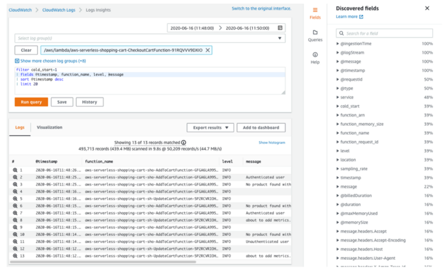

It’s a wrapper of Python’s logging library that provides extra capabilities such as JSON output configuration (and many more).

## Key features

* Capture key fields from Lambda context, cold start and structures logging output as JSON
* Log Lambda event when instructed (disabled by default)
* Append additional keys to structured log at any point in time

## Usage in Handler
The logger is a singleton which is defined under the utility folder **service.utils.infra.py** and imported in the handler.

## Blog Reference
Read more about the importance of the logger and how to use AWS CloudWatch logs in my blog. Click [**HERE**](https://www.ranthebuilder.cloud/post/aws-lambda-cookbook-elevate-your-handler-s-code-part-1-logging){:target="_blank" rel="noopener"}

## More details
You can find more information at the official documentation. Go to [https://awslabs.github.io/aws-lambda-powertools-python/latest/core/logger/](https://awslabs.github.io/aws-lambda-powertools-python/latest/core/logger/){:target="_blank" rel="noopener"}
