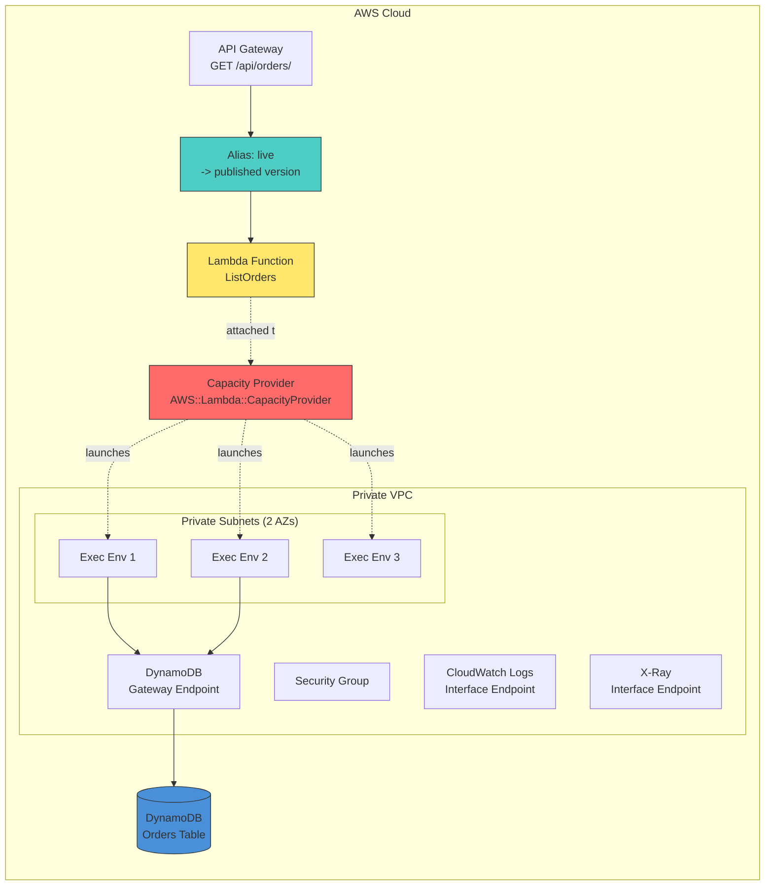

## **Overview**

AWS Lambda Managed Instances (LMI) runs a Lambda function on a pool of EC2 instances that Lambda provisions, scales, and patches on your behalf. Unlike standard Lambda, LMI keeps a minimum set of execution environments always warm, lets you cap concurrency *per environment* (rather than only per region), and lets you select instance families by RAM-to-vCPU ratio.

This project uses LMI to power the pagination-heavy `GET /api/orders/` endpoint, while the other CRUD endpoints stay on standard Lambda.

## **When LMI is the right choice**

LMI is worth its extra surface area (VPC, capacity provider, alias) when at least one of the following is true:

- The function has sustained or bursty traffic where cold starts hurt p95/p99.
- Per-invocation CPU or memory needs exceed what standard Lambda's 1-vCPU-per-1.8GB ratio gives you efficiently.
- You want a hard upper bound on concurrent invocations per environment (DynamoDB RCU pressure, downstream connection pools, memory-heavy Python workloads).
- You need predictable cost for an always-on base of capacity.

For the LIST endpoint specifically: paginated scans can run longer than single-item reads, they benefit from a warm client, and we want to cap how many scans run in parallel on one environment.

## **Architecture in this repo**

Two CDK pieces cooperate:

1. [`LambdaManagedInstanceConstruct`](https://github.com/ran-isenberg/aws-lambda-handler-cookbook/blob/main/cdk/service/lambda_managed_instance_construct.py) — builds the VPC (two AZs), private subnets, security group, VPC endpoints (DynamoDB gateway + Logs/X-Ray interface), the IAM operator role, and the `AWS::Lambda::CapacityProvider` resource.
2. The LIST handler wiring in [`api_construct.py`](https://github.com/ran-isenberg/aws-lambda-handler-cookbook/blob/main/cdk/service/api_construct.py) — a normal CDK Lambda function with two raw CloudFormation property overrides (`CapacityProviderConfig` and `FunctionScalingConfig`), plus a `live` alias because LMI only serves *published* versions.

## **Tuning knobs**

All values are centralised in [`cdk/service/constants.py`](https://github.com/ran-isenberg/aws-lambda-handler-cookbook/blob/main/cdk/service/constants.py):

| Constant | Purpose | Valid range |
| -------- | ------- | ----------- |
| `MANAGED_INSTANCE_MEMORY_SIZE` | Total memory per execution environment (MB) | Must equal `MEMORY_GIB_PER_VCPU * vCPU_count * 1024` for some integer vCPU count |
| `MANAGED_INSTANCE_MEMORY_GIB_PER_VCPU` | RAM-to-vCPU ratio; picks the EC2 family | `2` (c-family), `4` (m-family), `8` (r-family) |
| `MANAGED_INSTANCE_MAX_VCPU` | Upper bound for capacity provider scaling | 2 – 15000 |
| `MANAGED_INSTANCE_MAX_CONCURRENCY_PER_ENV` | Concurrent invocations per environment | 1 – 1600, additionally capped at `64 * vCPU_count` |
| `MANAGED_INSTANCE_MIN_EXECUTION_ENVIRONMENTS` | Always-on environments | 0 – 15000 (default 3 for multi-AZ) |
| `MANAGED_INSTANCE_MAX_EXECUTION_ENVIRONMENTS` | Upper bound for scale-out | 0 – 15000 |
| `MANAGED_INSTANCE_AVAILABILITY_ZONES` | Subnet AZs | 2+ recommended for resiliency |

## **Gotchas we hit in practice**

- **Memory/vCPU ratio constraint.** A `MemorySize` of `2096` MB with `MemoryGiBPerVCpu=4` fails with `Memory ratio of 4096.0MB per CPU exceeds function's total memory`. The total memory must be an exact multiple of the ratio × 1024.
- **`PerExecutionEnvironmentMaxConcurrency` cap.** AWS enforces `≤ 64 × vCPU_count`. At 4 GiB RAM with a 4 GiB/vCPU ratio you get 1 vCPU, so the cap is 64.
- **Version publish can fail with `FunctionErrorInitResourceExhausted`.** Publishing a version must initialize `MinExecutionEnvironments` environments. If any one OOMs during import/init, publish fails and rollback fails the same way. Raise `MEMORY_SIZE` or lower the min temporarily.
- **API Gateway must point at an alias.** LMI serves only published versions, so the CDK code creates a `live` alias and wires it into the integration — not `lambda_function` directly.
- **VPC endpoints matter.** The pool runs in private subnets with no NAT. Add VPC endpoints for every AWS service the handler calls (DynamoDB is a gateway endpoint, Logs and X-Ray are interface endpoints).

## **Related links**

- [Introducing AWS Lambda Managed Instances](https://aws.amazon.com/blogs/aws/introducing-aws-lambda-managed-instances-serverless-simplicity-with-ec2-flexibility/){:target="_blank" rel="noopener"}
- [Build high-performance apps with AWS Lambda Managed Instances](https://aws.amazon.com/blogs/compute/build-high-performance-apps-with-aws-lambda-managed-instances/){:target="_blank" rel="noopener"}
- [Lambda Managed Instances docs](https://docs.aws.amazon.com/lambda/latest/dg/lambda-managed-instances.html){:target="_blank" rel="noopener"}
