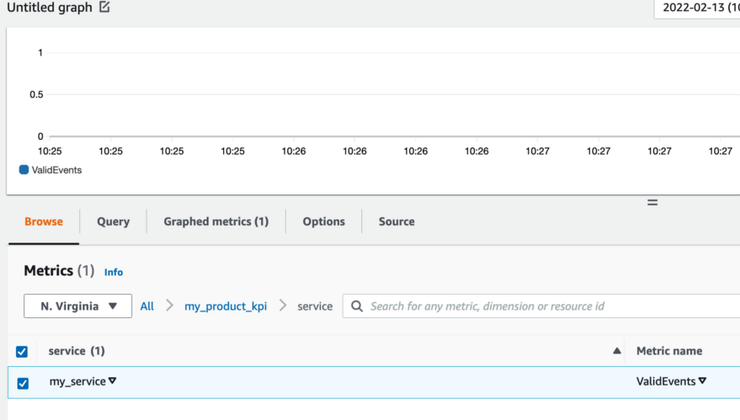

Business metrics and KPIs can drive your business forward towards success.

Metrics consist of a key and a value; A value can be a number, percentage, rate, or any other unit. Typical metrics are the number of sessions, users, error rate, number of views, etc.

The Metrics utility creates custom metrics asynchronously by logging metrics to standard output following [Amazon CloudWatch Embedded Metric Format (EMF)](https://docs.aws.amazon.com/AmazonCloudWatch/latest/monitoring/CloudWatch_Embedded_Metric_Format.html).

These metrics can be visualized through [Amazon CloudWatch Console](https://console.aws.amazon.com/cloudwatch/).



## **Key features**

* Aggregate up to 100 metrics using a single CloudWatch EMF object (large JSON blob)
* Validate against common metric definitions mistakes (metric unit, values, max dimensions, max metrics, etc)
* Metrics are created asynchronously by CloudWatch service, no custom stacks needed

## **Usage in Handler**

```python hl_lines="11 14 16" title="my_handler.py"
--8<-- "docs/examples/best_practices/metrics/my_handler.py"
```

## **Blog Reference**

Read more about the importance of the business KPis and metrics in my blog. Click [**HERE**](https://www.ranthebuilder.cloud/post/aws-lambda-cookbook-elevate-your-handler-s-code-part-3-business-domain-observability){:target="_blank" rel="noopener"}

## **More Details**

You can find more information at the official documentation.

Go to [https://docs.powertools.aws.dev/lambda-python/latest/core/metrics/](https://docs.powertools.aws.dev/lambda-python/latest/core/metrics/){:target="_blank" rel="noopener"}
