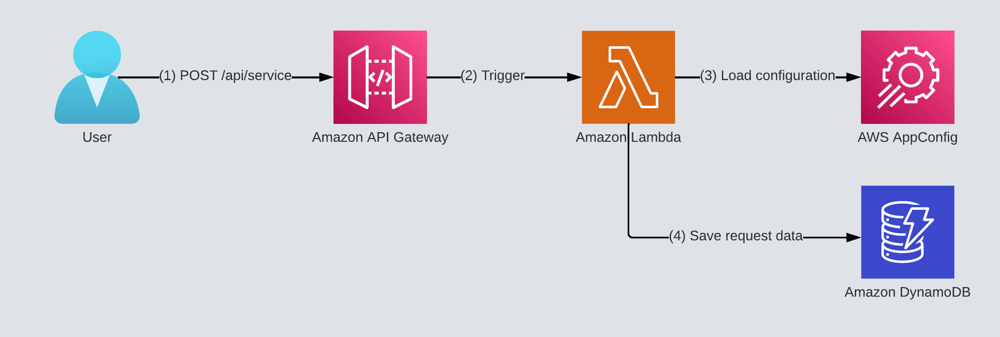
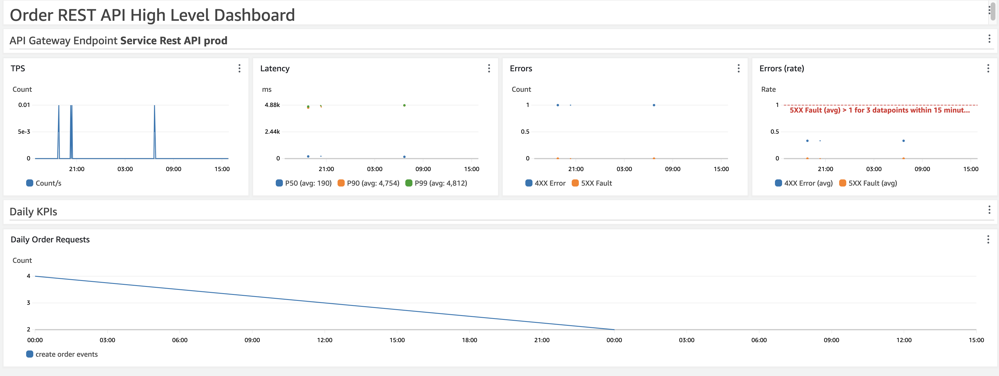
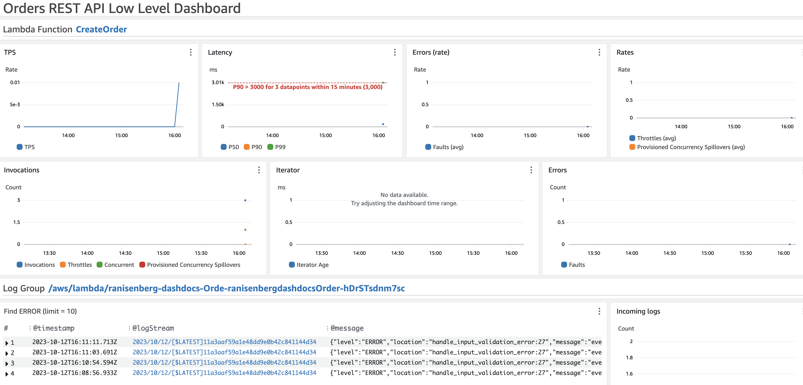
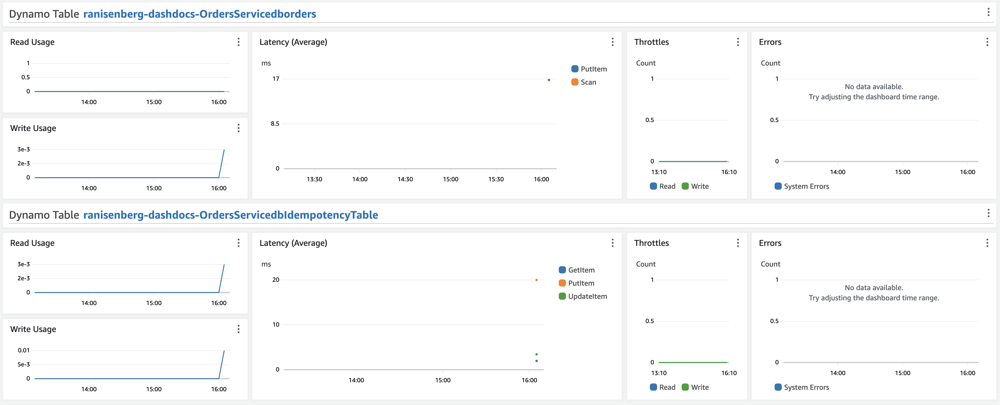
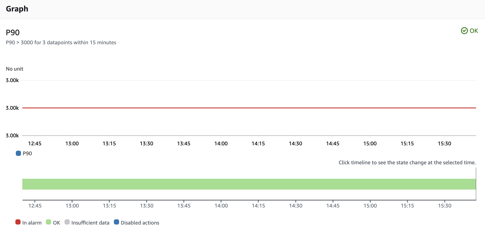
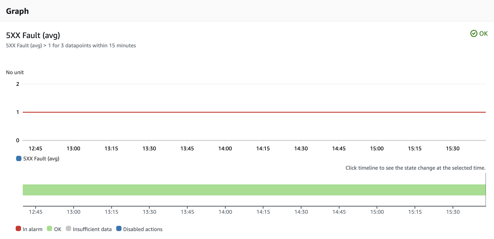

## **Key Concepts**

Utilizing AWS CloudWatch dashboards enables centralized monitoring of API Gateway, Lambda functions, and DynamoDB, providing real-time insights into their performance and operational health.
By aggregating metrics, logs, and alarms, CloudWatch facilitates swift issue diagnosis and analysis across your serverless applications. Additionally, setting up alarms ensures immediate alerts during anomalous activities, enabling proactive issue mitigation.

## **Service Architecture**

The goal is to monitor the service API gateway, Lambda function, and DynamoDB tables and ensure everything is in order.

In addition, we want to visualize service [KPI metrics](https://www.ranthebuilder.cloud/post/aws-lambda-cookbook-elevate-your-handler-s-code-part-3-business-domain-observability){:target="_blank" rel="noopener"}.

## **Monitoring Dashboards**

We will define two dashboards:

- High level
- Low level

Each dashboard has its usage and tailors different personas' usage.

### **High Level Dashboard**

This dashboard is designed to be an executive overview of the service.

Total API gateway metrics provide information on the performance and error rate of the service.

KPI metrics are included in the bottom part as well.

Personas that use this dashboard: SRE, developers, and product teams (KPIs)

### **Low Level Dashboard**

It is aimed at a deep dive into all the service's resources. Requires an understanding of the service architecture and its moving parts.

The dashboard provides the Lambda function's metrics for latency, errors, throttles, provisioned concurrency, and total invocations.

In addition, a CloudWatch logs widget shows only 'error' logs from the Lambda function.

As for DynamoDB tables, we have the primary database and the idempotency table for usage, operation latency, errors, and throttles.

Personas that use this dashboard: developers, SREs.

### **Alarms**

Having visibility and information is one thing, but being proactive and knowing beforehand that a significant error is looming is another. A CloudWatch

Alarm is an automated notification tool within AWS CloudWatch that triggers alerts based on user-defined thresholds, enabling users to identify and

respond to operational issues, breaches, or anomalies in AWS resources by monitoring specified metrics over a designated period.

In this dashboard, you will find an example of two types of alarms:

- Alarm for performance threshold monitoring
- Alarm for error rate threshold monitoring

For latency-related issues, we define the following alarm:

For P90, P50 metrics, follow this [explanation.](https://www.dnv.com/article/terminology-explained-p10-p50-and-p90-202611#:~:text=Proved%20(P90)%3A%20The%20lowest,equal%20or%20exceed%20P10%20estimate.){:target="_blank" rel="noopener"}

For internal server errors rate, we define the following alarm:

#### Actions

Alarms are of no use unless they have an action. We have configured the alarms to send an SNS notification to a new SNS topic.
From there, you can connect any subscription - HTTPS/SMS/Email, etc. to notify your teams with the alarm details.

## **CDK Reference**

We use the open-source [cdk-monitoring-constructs](https://github.com/cdklabs/cdk-monitoring-constructs){:target="_blank" rel="noopener"}.

You can view find the monitoring CDK construct [here](https://github.com/ran-isenberg/aws-lambda-handler-cookbook/blob/main/cdk/service/monitoring.py).

## **Further Reading**

If you wish to learn more about this concept and go over details on the CDK code, check out my [blog post](https://www.ranthebuilder.cloud/post/how-to-effortlessly-monitor-serverless-applications-with-cloudwatch-part-one).
