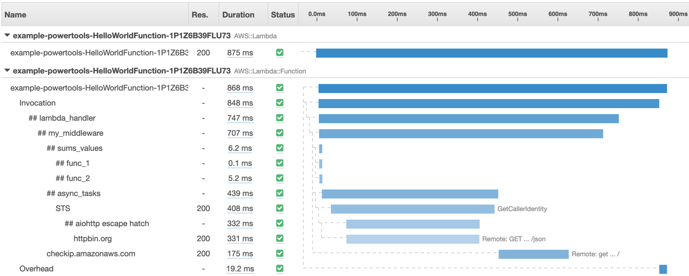

Tracer is a thin wrapper for [AWS X-Ray Python SDK](https://github.com/aws/aws-xray-sdk-python/).



## **Key features**

* Enables AWS X-Ray traces for your handler by using simple and clean decorators
* Captures handler and inner functions
* Auto capture cold start as annotation, and responses or full exceptions as metadata

## **Usage in Handler**

```python hl_lines="11 14 19" title="my_handler.py"
--8<-- "docs/examples/best_practices/tracer/my_handler.py"
```

## **Blog Reference**

Read more about the importance of observability and traces in my blog. Click [**HERE**](https://www.ranthebuilder.cloud/post/aws-lambda-cookbook-elevate-your-handler-s-code-part-2-observability){:target="_blank" rel="noopener"}

## **More Details**

You can find more information at the official documentation.

Go to [https://awslabs.github.io/aws-lambda-powertools-python/latest/core/tracer/](https://awslabs.github.io/aws-lambda-powertools-python/latest/core/tracer/){:target="_blank" rel="noopener"}
