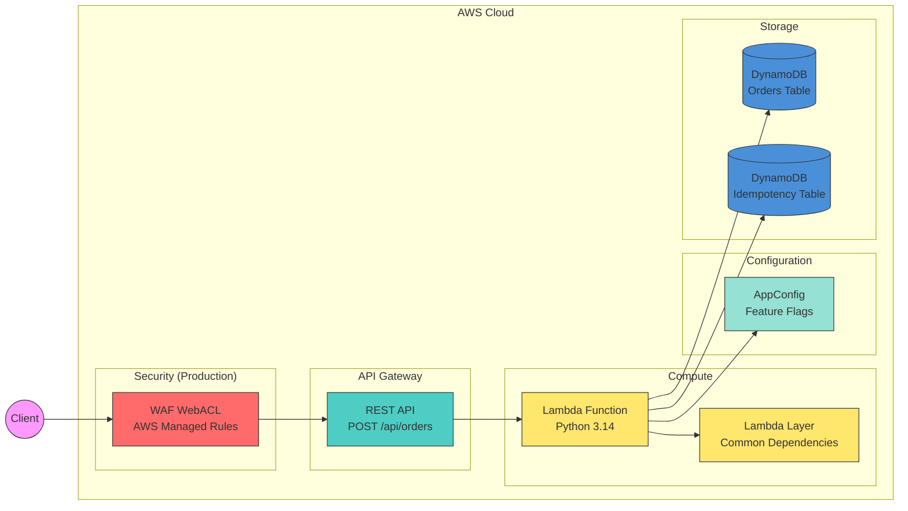
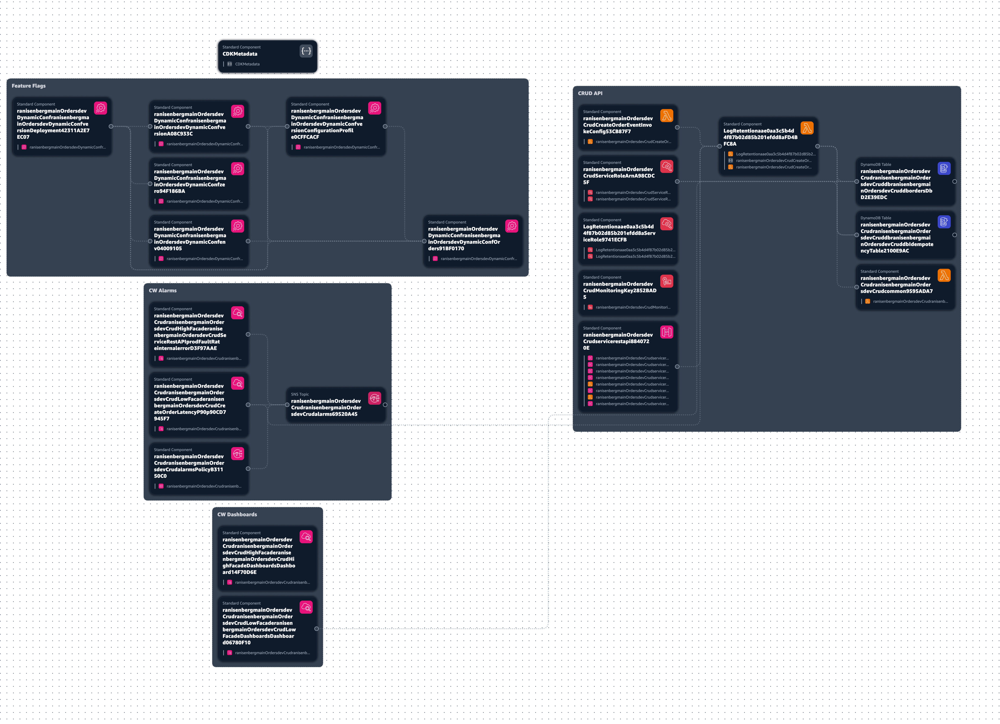

## **Prerequisites**

- Follow this [getting started with CDK guide](https://docs.aws.amazon.com/cdk/v1/guide/getting_started.html){:target="_blank" rel="noopener"}
- Make sure your AWS account and machine can deploy an AWS Cloudformation stack and have all the tokens and configuration as described in the page above.
- CDK Best practices [blog](https://www.ranthebuilder.cloud/post/aws-cdk-best-practices-from-the-trenches){:target="_blank" rel="noopener"}
- Lambda layers best practices [blog](https://www.ranthebuilder.cloud/post/aws-lambda-layers-best-practices){:target="_blank" rel="noopener"}

## **CDK Deployment**

Click diagram to zoom

All CDK project files can be found under the CDK folder.

The CDK code create an API GW with a path of /api/orders which triggers the lambda on 'POST' requests.

The AWS Lambda handler uses a Lambda layer optimization which takes all the packages under the [packages] section in the Pipfile and downloads them in via a Docker instance.

This allows you to package any custom dependencies you might have.

In order to add a new dev dependency, add it to the pyproject.toml under the ``[dependency-groups]`` dev section and run ``uv lock && uv sync``.

In order to add a new Lambda runtime dependency, add it to the pyproject.toml under the ``[project]`` dependencies section and run ``uv lock && uv sync``.

### **CDK Constants**

All AWS Lambda function configurations are saved as constants at the `cdk.service.constants.py` file and can easily be changed.

- Memory size
- Timeout in seconds
- Lambda dependencies build folder location
- Lambda Layer dependencies build folder location
- Various resources names
- Lambda function environment variables names and values

### **Deployed Resources**

- AWS Cloudformation stack: **cdk.service.service_stack.py** which is consisted of one construct
- Construct: **cdk.service.api_construct.py** which includes:
    - **Lambda Layer** - deployment optimization meant to be used with multiple handlers under the same API GW, sharing code logic and dependencies. You can read more in [my blog post on Lambda layers best practices](https://www.ranthebuilder.cloud/post/aws-lambda-layers-best-practices){:target="_blank" rel="noopener"}.
    - **Lambda Function** - The Lambda handler function itself. Handler code is taken from the service `folder`.
    - **Lambda Role** - The role of the Lambda function.
    - **API GW with Lambda Integration** - API GW with a Lambda integration POST /api/orders that triggers the Lambda function.
    - **AWS DynamoDB table** - stores request data. Created in the `api_db_construct.py` construct.
    - **AWS DynamoDB table** - stores idempotency data. Created in the `api_db_construct.py` construct.
- Construct: **cdk.service.configuration.configuration_construct.py** which includes:
    - AWS AppConfig configuration with an environment, application, configuration and deployment strategy. You can read more in the [dynamic configuration documentation](best_practices/dynamic_configuration.md).

### **Infrastructure CDK & Security Tests**

Under tests there is an `infrastructure` folder for CDK infrastructure tests.

The first test, `test_cdk` uses CDK's testing framework which asserts that required resources exists so the application will not break anything upon deployment.

The security tests are based on `cdk_nag`. It checks your cloudformation output for security best practices. It can be found in the `service_stack.py` as part of the stack definition. It will fail the deployment when there is a security issue.

For more information see the [AWS CDK-Nag documentation](https://docs.aws.amazon.com/prescriptive-guidance/latest/patterns/check-aws-cdk-applications-or-cloudformation-templates-for-best-practices-by-using-cdk-nag-rule-packs.html){:target="_blank" rel="noopener"}.

### Deployed Resources

In the picture below you can see all the deployed resources ordered into domain groups. The image was created with the IDE plugin of AWS Application Composer.

