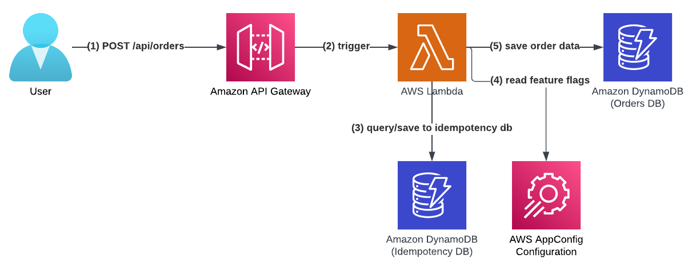

## **AWS Lambda Handler Cookbook - A Serverless Service Template**

## **The Problem**

Starting a Serverless service can be overwhelming. You need to figure out many questions and challenges that have nothing to do with your business domain:

- How to deploy to the cloud? What IAC framework do you choose?
- How to write a SaaS-oriented CI/CD pipeline? What does it need to contain?
- How do you handle observability, logging, tracing, metrics?
- How do you handle testing?

## **The Solution**

This project aims to reduce cognitive load and answer these questions for you by providing a skeleton Python Serverless service template that implements best practices for AWS Lambda, Serverless CI/CD, and AWS CDK in one template project.

### Serverless Service - The Order service

- This project provides a working orders service where customers can create orders of items.

- The project deploys an API GW with an AWS Lambda integration under the path POST /api/orders/ and stores orders data in a DynamoDB table.

#### **Monitoring Design**

### **Features**

- Python Serverless service with a recommended file structure.
- CDK infrastructure with infrastructure tests and security tests.
- CI/CD pipelines based on Github actions that deploys to AWS with python linters, complexity checks and style formatters.
- CI/CD pipeline deploys to dev/staging and production environment with different gates between each environment
- Makefile for simple developer experience.
- The AWS Lambda handler embodies Serverless best practices and has all the bells and whistles for a proper production ready handler.
- AWS Lambda handler uses [AWS Lambda Powertools](https://docs.powertools.aws.dev/lambda-python/){:target="_blank" rel="noopener"}.
- AWS Lambda handler 3 layer architecture: handler layer, logic layer and data access layer
- Features flags and configuration based on AWS AppConfig
- CloudWatch dashboards - High level and low level including CloudWatch alarms
- Idempotent API
- REST API protected by WAF with four AWS managed rules in production deployment
- Unit, infrastructure, security, integration and E2E tests.

The GitHub template project can be found at [https://github.com/ran-isenberg/aws-lambda-handler-cookbook](https://github.com/ran-isenberg/aws-lambda-handler-cookbook){:target="_blank" rel="noopener"}.

## **Serverless Best Practices**

The AWS Lambda handler will implement multiple best practice utilities.

Each utility is implemented when a new blog post is published about that utility.

The utilities cover multiple aspects of a production-ready service, including:

- [**Logging**](best_practices/logger.md)
- [**Observability: Monitoring and Tracing**](best_practices/tracer.md)
- [**Observability: Business KPI Metrics**](best_practices/metrics.md)
- [**Environment Variables**](best_practices/environment_variables.md)
- [**Input Validation**](best_practices/input_validation.md)
- [**Dynamic configuration & features flags**](best_practices/dynamic_configuration.md)
- [**Serverless Monitoring**](https://www.ranthebuilder.cloud/post/how-to-effortlessly-monitor-serverless-applications-with-cloudwatch-part-one)
- [**API Idempotency**](https://www.ranthebuilder.cloud/post/serverless-api-idempotency-with-aws-lambda-powertools-and-cdk){:target="_blank" rel="noopener"}
- [**Learn How to Write AWS Lambda Functions with Three Architecture Layers**](https://www.ranthebuilder.cloud/post/learn-how-to-write-aws-lambda-functions-with-architecture-layers){:target="_blank" rel="noopener"}

While the code examples are written in Python, the principles are valid to any supported AWS Lambda handler programming language.

## **License**

This library is licensed under the MIT License. See the [LICENSE](https://github.com/ran-isenberg/aws-lambda-handler-cookbook/blob/main/LICENSE) file.
