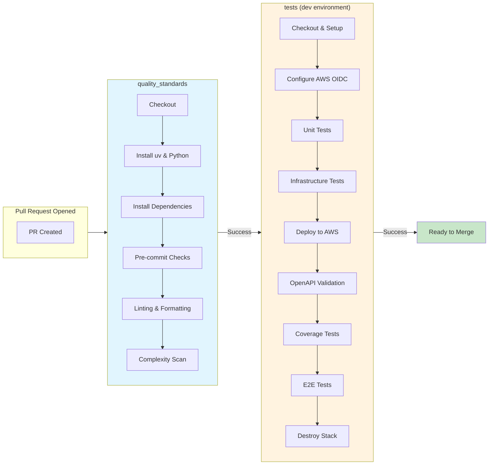
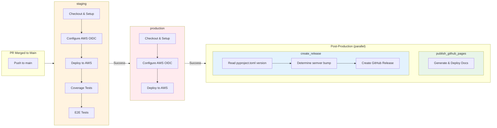

## **Getting Started**

The GitHub CI/CD pipeline includes the following steps.

!!! warning "Required Configuration"
    The pipelines uses environment secrets (under the defined environment 'dev', 'staging' and 'production') for code coverage and for the role to deploy to AWS.

When you clone this repository be sure to define the environments in your [repo settings](https://docs.github.com/en/actions/deployment/targeting-different-environments/using-environments-for-deployment) and create a secret per environment:

- `AWS_ROLE_ARN` - the role ARN to assume for your GitHub worker as defined in the [GitHub OIDC documentation for AWS](https://docs.github.com/en/actions/deployment/security-hardening-your-deployments/configuring-openid-connect-in-amazon-web-services)

!!! tip "Quick Start"
    Run `make pr` locally to validate all checks before pushing. This runs the same checks as the CI pipeline.

### **Makefile Commands**

All steps can be run locally using the makefile. See details below:

- Create Python environment
- Install dev dependencies
- Run pre-commit checks as defined in `.pre-commit-config.yaml`
- Lint and format and sort imports with ruff (similar to flake8/yapf/isort) - run `make format` in the IDE
- Static type check with mypy as defined in `.mypy.ini` - run `make lint` in the IDE
- Verify that Python imports are sorted according to standard - run `make sort` in the IDE
- Python complexity checks: radon and xenon  - run `make complex` in the IDE
- Unit tests. Run `make unit` to run unit tests in the IDE
- Infrastructure test. Run `make infra-tests` to run the CDK infrastructure tests in the IDE
- Code coverage by [codecov.io](https://about.codecov.io/)
- Deploy CDK - run `make deploy` in the IDE, will also run security tests based on cdk_nag
- Integration tests - run `make integration` in the IDE.
- E2E tests  - run `make e2e` in the IDE
- Code coverage tests  - run `make coverage-tests` in the IDE after CDK dep
- OpenAPI Swagger file - run
- Update GitHub documentation branch
- Update dependencies and CDK version automatically to the latest versions: run `make update-deps`.

### **Other Capabilities**

- Automatic Python dependencies update with Dependabot
- Easy to use makefile allows to run locally all commands in the GitHub actions
- Run local docs server, prior to push in pipeline - run `make docs`  in the IDE
- Prepare PR, run all checks with one command - run `make pr` in the IDE

## **Environments & Pipelines**

All GitHub workflows are stored under `.github/workflows` folder.

The two most important ones are `pr-serverless-service`  and `main-serverless-service`.

### **pr-serverless-service**



*:material-magnify-plus-outline: Click diagram to zoom*

`pr-serverless-service` runs for every pull request you open. It expects you defined a GitHub environments by the name `dev`, `staging` and `production` and for each environments to have the following variables: `CODECOV_TOKEN` for CodeCov integration and `AWS_ROLE` that allows GitHub to deploy to that AWS account (one for dev, one for staging and one for production accounts).

It includes two jobs: 'quality_standards' and 'tests' where a failure in 'quality_standards' does not trigger 'tests'. Both jobs MUST pass in order to to be able to merge.

'quality_standards' includes all linters, pre-commit checks and units tests and 'tests' deploys the service to AWS, runs code coverage checks,

checks that your OpenAPI file is up to date and corresponds to the actual deployment (fails if it does not, hence your documentation is out of date), security checks and E2E tests. Stack is destroyed at the end. Stack has a 'dev'

prefix as part of its name. Each environment has a pre-defined stack prefix.

Once merged, `main-serverless-service` will run.

### **main-serverless-service**



*:material-magnify-plus-outline: Click diagram to zoom*

`main-serverless-service` runs for every MERGED pull request that runs on the main branch. It expects you defined a GitHub environments by the name `staging` and `production` and that both includes a secret by the name of `AWS_ROLE`.

It includes three jobs: 'staging', 'production' and 'publish_github_pages'.

'staging' does not run any of the 'quality_standards' checks, since they were already checked before the code was merged. It runs just coverage tests and E2E tests. Stack is not deleted. Stack has a 'staging' prefix as part of its name.
Any failure in staging will stop the pipeline and production environment will not get updated with the new code.

'production' does not run any of the 'quality_standards' checks, since they were already checked before the code was merged. It does not run any test at the moment. Stack is not deleted. Stack has a 'production' prefix as part of its name.

### **create_release**

After successful production deployment, the `create_release` job automatically creates a GitHub release with auto-generated release notes.

**How versioning works:**

1. The job reads the version from `pyproject.toml`
2. If this version hasn't been released yet, it uses it as-is
3. If already released, it analyzes commits since the last tag:
   - Commits with `!:` (e.g., `feat!:`) → **Major** version bump
   - Commits with `feat:` or `feature:` → **Minor** version bump
   - Other commits → **Patch** version bump

Release notes are automatically generated based on the merged PRs and their labels.

---

## **Automatic PR Labeling**

The `pr-labeler` workflow automatically labels PRs based on commit message prefixes following [Conventional Commits](https://www.conventionalcommits.org/).

### **pr-labeler**

This workflow runs on every PR and:

1. **Creates required labels** if they don't exist in the repository
2. **Scans commit messages and PR title** for conventional commit prefixes
3. **Applies matching labels** to the PR

| Commit Prefix                  | Label Applied     | Release Notes Section   |
| ------------------------------ | ----------------- | ----------------------- |
| `feat:` or `feature:`          | `enhancement`     | Exciting New Features 🎉 |
| `fix:`                         | `bug`             | Bug Fixes 🐛             |
| `docs:`                        | `documentation`   | Documentation 📚         |
| `chore:`                       | `chore`           | Maintenance 🔧           |
| `feat!:` or `fix!:` (with `!`) | `breaking-change` | Breaking Changes 🛠      |

### **Release Notes Configuration**

The `.github/release.yml` file configures how GitHub generates release notes. PRs are categorized into sections based on their labels, which are automatically applied by the `pr-labeler` workflow.

This creates a seamless flow:

```text
Commit with prefix → PR gets labeled → PR merged → Release created with categorized notes
```
