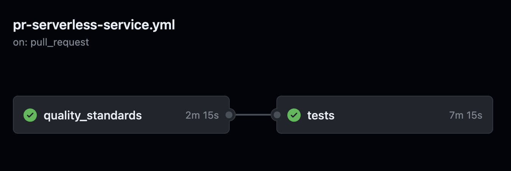
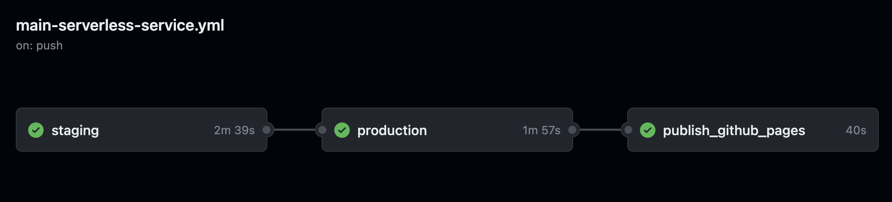

## **Getting Started**

The GitHub CI/CD pipeline includes the following steps.

The pipelines uses environment secrets (under the defined environment 'dev', 'staging' and 'production') for code coverage and for the role to deploy to AWS.

When you clone this repository be sure to define the environments in your [repo settings](https://docs.github.com/en/actions/deployment/targeting-different-environments/using-environments-for-deployment) and create a secret per environment:

- AWS_ROLE - to role to assume for your GitHub worker as defined [here](https://docs.github.com/en/actions/deployment/security-hardening-your-deployments/configuring-openid-connect-in-amazon-web-services)

### **Makefile Commands**

All steps can be run locally using the makefile. See details below:

- Create Python environment
- Install dev dependencies
- Run pre-commit checks as defined in `.pre-commit-config.yaml`
- Lint and format and sort imports with ruff (similar to flake8/yapf/isort) - run `make format` in the IDE
- Static type check with mypy as defined in `.mypy.ini` - run `make lint` in the IDE
- Verify that Python imports are sorted according to standard - run `make sort` in the IDE
- Python complexity checks: radon and xenon  - run `make complex` in the IDE
- Unit tests. Run `make unit` to run unit tests in the IDE
- Infrastructure test. Run `make infra-tests` to run the CDK infrastructure tests in the IDE
- Code coverage by [codecov.io](https://about.codecov.io/)
- Deploy CDK - run `make deploy` in the IDE, will also run security tests based on cdk_nag
- E2E tests  - run `make e2e` in the IDE
- Code coverage tests  - run `make coverage-tests` in the IDE after CDK dep
- Update GitHub documentation branch

### **Other Capabilities**

- Automatic Python dependencies update with Dependabot
- Easy to use makefile allows to run locally all commands in the GitHub actions
- Run local docs server, prior to push in pipeline - run `make docs`  in the IDE
- Prepare PR, run all checks with one command - run `make pr` in the IDE

## **Environments & Pipelines**

All GitHub workflows are stored under `.github/workflows` folder.

The two most important ones are `pr-serverless-service`  and `main-serverless-service`.

### **pr-serverless-service**

`pr-serverless-service` runs for every pull request you open. It expects you defined a GitHub environment by the name `dev` and that it includes a secret by the name of `AWS_ROLE`.

It includes two jobs: 'quality_standards' and 'tests' where a failure in 'quality_standards' does not trigger 'tests'. Both jobs MUST pass in order to to be able to merge.

'quality_standards' includes all linters, pre-commit checks and units tests and 'tests' deploys the service to AWS, runs code coverage checks, security checks and E2E tests. Stack is destroyed at the end. Stack has a 'dev' prefix as part of its name.

Once merged, `main-serverless-service` will run.

### **main-serverless-service**

`main-serverless-service` runs for every MERGED pull request that runs on the main branch. It expects you defined a GitHub environments by the name `staging` and `production` and that both includes a secret by the name of `AWS_ROLE`.

It includes three jobs: 'staging', 'production' and 'publish_github_pages'.

'staging' does not run any of the 'quality_standards' checks, since they were already checked before the code was merged. It runs just coverage tests and E2E tests. Stack is not deleted. Stack has a 'staging' prefix as part of its name.
Any failure in staging will stop the pipeline and production environment will not get updated with the new code.

'production' does not run any of the 'quality_standards' checks, since they were already checked before the code was merged. It does not run any test at the moment. Stack is not deleted. Stack has a 'production' prefix as part of its name.
